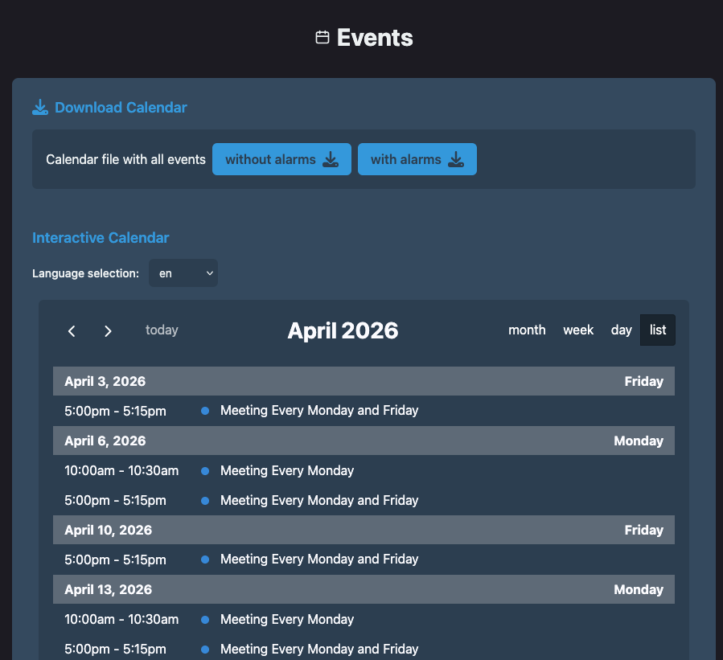
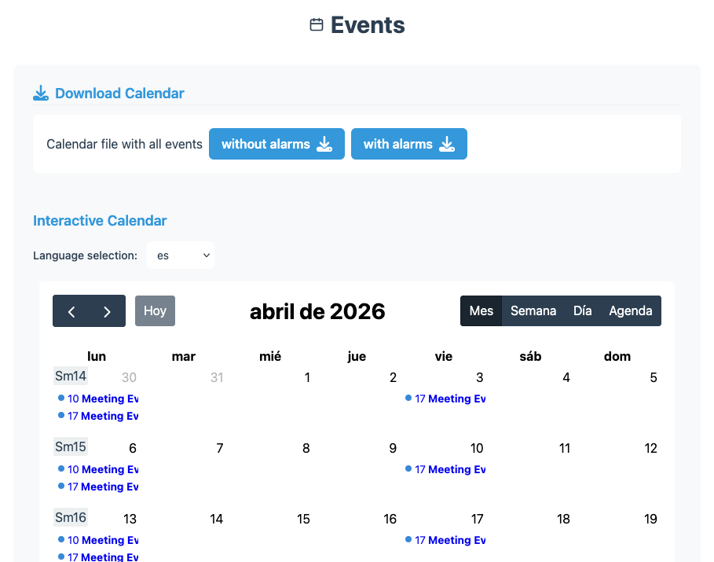

# Hugo iCalendar Theme Component

[](https://gohugo.io/)
[](https://tools.ietf.org/html/rfc5545)
[](#internationalization)

A Hugo theme component to generate [iCalendar (.ics)](https://en.wikipedia.org/wiki/ICalendar) files from Hugo content with recurrence rules and alarm support.

**Original work:** This theme component is based on [hugo-ical-templates](https://github.com/raoulb/hugo-ical-templates) by Raoul B.

## Demo & Resources

- [**Live Demo**](https://finkregh.github.io/hugo-theme-component-ical/)
- [Demo Source Code](https://github.com/Finkregh/hugo-theme-component-ical/tree/main/.github/exampleSite)
- [CI Validation Workflow](https://github.com/Finkregh/hugo-theme-component-ical/blob/main/.github/workflows/validate-ical.yml)
- [Build Commands](https://github.com/Finkregh/hugo-theme-component-ical/blob/main/justfile)





## Features

### 🗓️ Core iCalendar Features

- **Timezone Support**: UTC conversion for universal compatibility (specify timestamps with explicit timezone or without and use timezone from settings)
- **Recurrence Rules**: RRULE patterns with BYSETPOS, BYDAY support
- **Alarm System**: DISPLAY, EMAIL, and AUDIO alarms 
- **Status Management**: Event status handling(CONFIRMED, TENTATIVE, CANCELLED)

### Additional templates

- **JavaScript Calendar Display**: Optional [FullCalendar.js](https://fullcalendar.io/) integration
- **Responsive Design**: Mobile-friendly calendar views
- **Download Links**: Direct iCal file download functionality
- **Multiple Output Formats**: Both standard and alarm-enabled calendar files

## Template Structure

The project uses a modern template structure compatible with Hugo v0.146.0+:

```text
layouts/
├── list.calendar.ics                   # List template for calendar format
├── list.calendarwithalarms.ics         # List template with VALARM support
├── single.calendar.ics                 # Single page calendar template
├── single.calendarwithalarms.ics       # Single page with alarms template
├── _default/
│   └── baseof.html                     # HTML base template
├── _partials/
│   ├── calendar_js.html                # Calendar JavaScript
│   ├── calendar_single.html            # Single event display
│   ├── calendar_section.html           # Calendar section display
│   ├── header.ics                      # Generic iCal header partial
│   ├── event.ics                       # Generic event partial
│   ├── event-with-alarms.ics           # Event with alarm support
│   ├── timezone.ics                    # Timezone definition partial
│   ├── recurrence_human_readable.html  # Human-readable recurrence
│   ├── events/
│   │   └── event-card.html             # Event card component
│   ├── ical/                          # iCal component library (50+ partials)
│   │   ├── cal_props.ics              # Calendar properties
│   │   ├── comp_event.ics             # VEVENT component
│   │   ├── comp_time_zone.ics         # VTIMEZONE component
│   │   ├── comp_valarm.ics            # VALARM component
│   │   ├── dt_*.ics                   # Data type formatters
│   │   ├── param_*.ics                # Parameter formatters
│   │   └── prop_*.ics                 # Property formatters
│   └── recurrence/                     # Recurrence pattern handlers
│       ├── daily_frequency.html
│       ├── weekly_frequency.html
│       ├── monthly_frequency.html
│       └── yearly_frequency.html
└── events/
    ├── list.html                       # Events list HTML template
    └── single.html                     # Events single HTML template
```

## Installation

### Hugo Version Compatibility

- **Recommended**: v0.150.0+ (as specified in [`hugo.toml`](hugo.toml))
- **Tested With**: v0.160.1+extended

### 1. Add Hugo Module

Add this theme component as a Hugo module to your project's [`hugo.toml`](hugo.toml) config file:

```toml
[module]
[[module.imports]]
path = 'github.com/finkregh/hugo-theme-component-ical'
```

Fetch or update the configured modules:

```shell
# Initialize Hugo modules (if not done before)
hugo mod init yourdomain.com

# Get the module
hugo mod get -u ./...
```

### 2. Configuration

#### Timezone configuration

Either specify every single calendar-related timestamp with explicit timezone
(e.g. `startDate: 2024-04-21T09:00:00+02:00`) or apply these settings:

Timezone handling involves two separate concerns that require **two configuration settings**:

1. **Hugo's `timeZone`** (top-level config) -- controls how front matter dates without timezone offsets are parsed. This is a built-in Hugo setting ([docs](https://gohugo.io/getting-started/configuration/#timezone)).
2. **`params.ical.timezone`** -- tells the ICS templates which IANA timezone to use when generating `.ics` calendar files (for `time.AsTime` reparsing and VTIMEZONE output).

Both must be set. Hugo's `timeZone` is **not accessible in templates**, so the ICS templates rely on the param.

```toml
# hugo.toml (or config/_default/hugo.toml)

# Required: Hugo uses this to parse front matter dates without timezone offsets
timeZone = "Europe/Berlin"

[params.ical]
# Required: ICS templates use this for calendar file generation
timezone = "Europe/Berlin"
```

Hugo also supports per-language `timeZone` for multilingual sites:

```toml
[languages.en]
timeZone = "America/New_York"

[languages.de]
timeZone = "Europe/Berlin"
```

#### Output Formats

Configure the `Calendar` and `CalendarWithAlarms` output formats in your [`hugo.toml`](hugo.toml):

```toml
[outputs]
  page = ["HTML", "Calendar", "CalendarWithAlarms"]
  section = ["HTML", "Calendar", "CalendarWithAlarms"]

[outputFormats.Calendar]
  baseName = "calendar"
  mediaType = "text/calendar"
  isPlainText = true
  permalinkable = true
  suffix = "ics"
  protocol = "https://"

[outputFormats.CalendarWithAlarms]
  baseName = "calendar-alarms"
  mediaType = "text/calendar"
  isPlainText = true
  permalinkable = true
  suffix = "ics"
  protocol = "https://"
```

The `CalendarWithAlarms` output format generates iCalendar files that include alarm/reminder components (VALARM) in addition to the event data.

### 3. Link to Calendar Files

Link the generated `ics` files for download on your HTML pages:

```html
{{ with .OutputFormats.Get "Calendar" }}
    <a href="{{ .RelPermalink }}" type="text/calendar">{{ $.Title }}</a>
{{ end }}
```

For calendars with alarms:

```html
{{ with .OutputFormats.Get "CalendarWithAlarms" }}
    <a href="{{ .RelPermalink }}" type="text/calendar">{{ $.Title }} (with alarms)</a>
{{ end }}
```

### 4. (Optional) JavaScript Calendar Display

Enable visual calendar display with JavaScript libraries downloaded from npmjs.org:

#### With npm

```shell
# Initial setup (after hugo mod get)
hugo mod npm pack
npm install
```

Include the JavaScript in your templates:

```html
<!-- Separate .js file -->
{{ partial "calendar_js.html" . }}

<!-- Conditional JavaScript loader -->
{{ partial "calendar_js_conditional.html" . }}
```

#### Pre-built Partials

Use the provided partials in your [`layouts/events/`](layouts/events/) templates:

**[`single.html`](layouts/events/single.html):**

```html
{{ partial "calendar_single.html" . }}
```

**[`list.html`](layouts/events/list.html):**

```html
{{ partial "calendar_section.html" . }}
```

## Usage - Event Specification

Events are specified in the front matter:

### Basic Event

```yaml
---
title: Important Meeting

startDate: 2024-01-08T09:00:00+01:00
endDate: 2024-01-08T09:30:00+01:00
where: "Meeting Room 1, Main Office"
orga: "Scrum Master"
orgaEmail: "scrummaster@example.org"
---
```


### Timezone Handling

#### How Front Matter Dates Work

Dates in front matter can be written **with or without** explicit timezone offsets:

```yaml
# Without offset -- Hugo interprets using the configured timeZone
startDate: 2026-03-15T14:00:00

# With explicit offset -- the offset takes precedence over any config
startDate: 2026-03-15T14:00:00+01:00
```

Both formats work correctly. When no offset is present, Hugo's `timeZone` setting determines how the time is interpreted. When an offset is present, it is used as-is.

#### Per-Event Timezone Override (ICS only)

Individual events can override the timezone for ICS generation using the `icaltimezone` front matter parameter:

```yaml
---
title: "Auckland Meetup"
startDate: 2026-03-15T14:00:00+13:00
icaltimezone: "Pacific/Auckland"
---
```

The ICS template timezone resolution order is:
1. Page parameter: `icaltimezone`
2. Site parameter: `params.ical.timezone`
3. Build fails if neither is set

#### ICS Output: UTC Conversion

Generated `.ics` files convert all times to UTC for maximum compatibility:

**Input** (front matter):

```yaml
startDate: 2026-03-15T14:00:00  # Interpreted as 14:00 CET (Europe/Berlin)
```

**Output** (`.ics` file):

```ics
DTSTART;VALUE=DATE-TIME:20260315T130000Z
```

This UTC-only approach means:

- All calendar clients support UTC and convert to the user's local timezone for display
- No VTIMEZONE components needed, resulting in smaller `.ics` files
- No timezone database maintenance or DST rule updates needed
- Follows RFC 5545 Section 3.3.5

#### HTML Output: Timezone Preserved

HTML event pages display times in the configured timezone:

```html
<time datetime="2026-03-15T14:00:00+01:00">
  March 15, 2026, 2:00:00 pm CET
</time>
```

This relies entirely on Hugo's built-in `timeZone` config for correct parsing and formatting.


### Recurrence Patterns

#### Every Monday

```yaml
recurrenceRule:
  freq: "WEEKLY"
  byDay: "MO"
```

#### Third Sunday of April (yearly)

```yaml
recurrenceRule:
  freq: "YEARLY"
  byMonth: 4
  byDay: "SU"
  bySetPos: 3
```

#### First and Second Monday of October (yearly)

```yaml
recurrenceRule:
  freq: "YEARLY"
  byMonth: 10
  byDay: "MO"
  bySetPos: [1, 2]
```

#### Every Last Sunday of Every 3 Months

```yaml
recurrenceRule:
  freq: "MONTHLY"
  interval: 3
  byDay: "SU"
  bySetPos: -1
```

### Alarm Configuration

#### Display Alarm (Popup Reminder)

```yaml
alarms:
  - action: "DISPLAY"
    trigger:
      duration: "-PT15M" # 15 minutes before event start
    description:
      text: "Meeting starts in 15 minutes"
      lang: "en"
```

#### Email Alarm with Multiple Recipients

```yaml
alarms:
  - action: "EMAIL"
    trigger:
      duration: "-PT1H" # 1 hour before event start
    description:
      text: "Don't forget about the meeting in 1 hour"
      lang: "en"
    summary:
      text: "Meeting Reminder"
      lang: "en"
    attendee:
      - email: "ahmed.doe@example.com"
        commonName: "Ahmed Doe"
      - email: "jane.smith@example.com"
        commonName: "Jane Smith"
```

#### Duration Format Reference

- `PT15M` = 15 minutes
- `PT1H` = 1 hour
- `P1D` = 1 day
- `P1W` = 1 week
- `-PT15M` = 15 minutes before (negative for "before")
- `PT15M` = 15 minutes after (positive for "after")


### Internationalization

- **English (EN)**: [`i18n/en.toml`](i18n/en.toml)
- **German (DE)**: [`i18n/de.toml`](i18n/de.toml)

#### Translation Categories

- **Event Metadata**: Event details, date/time, location, organizer
- **Recurrence Patterns**: Human-readable recurrence descriptions
- **Calendar Interface**: Download links, calendar views, navigation
- **Status Messages**: Event status, cancellation notices
- **Template Elements**: Form labels, buttons, technical details

#### Usage in Templates

```html
{{ i18n "ical_event_details" }}
{{ i18n "ical_download_ics" (dict "title" .Title) }}
{{ i18n "ical_recurrence_every_interval" (dict "count" 2 "unit" "weeks") }}
```

#### Adding New Languages

1. Create new translation file: [`i18n/[lang].toml`](i18n/)
2. Copy structure from [`i18n/en.toml`](i18n/en.toml)
3. Translate all keys maintaining parameter placeholders
4. Test with content in the new language

## Development notes

### Build Verification

Successful builds should show:

- **Exit Code**: 0 (no errors)
- **Template Resolution**: All templates resolving correctly
- **iCal Validation**: RFC 5545 compliant output
- **No ERROR Messages**: Only informational WARN messages for debugging

### Local Development Setup

Use the setup in [`.github/exampleSite/`](.github/exampleSite/) to test changes locally:

```shell
# Run development server with example site
hugo server --source .github/exampleSite

# Build and validate
hugo --source .github/exampleSite
```

### Template Development Guidelines

#### 1. Context Management

Always pass complete context to partials:

```go
{{- partial "component.ics" (dict "Page" . "Site" $.Site "Params" .Params) -}}
```

#### 2. Error Handling

Include error checking:

```go
{{- if not .Page -}}
    {{- errorf "Page context required for %s" .Name -}}
{{- end -}}
```

#### 3. Fallback Logic

Implement graceful fallbacks for missing components:

```go
{{- $sectionSpecific := printf "_partials/component.%s.ics" .Section -}}
{{- if templates.Exists $sectionSpecific -}}
    {{- partial (printf "component.%s.ics" .Section) . -}}
{{- else -}}
    {{- warnf "Section-specific component not found: %s, using generic" $sectionSpecific -}}
    {{- partial "component.ics" . -}}
{{- end -}}
```

### Testing and Validation

#### Build Testing

```shell
# Test build with example site
PR_NUMBER=0 just test
```

We use both Python and JavaScript validation to make sure ics parsing quirks of the used libraries do not lead to false-positives.

- [validate_ics.py](.github/scripts/validate_ics.py)
- [validate_ics.mjs](.github/scripts/validate_ics.mjs)

Individual Test Targets:

```shell
# Python validation only
PR_NUMBER=0 just test_python

# JavaScript validation only
PR_NUMBER=0 just test_js

# Debug mode with validation
PR_NUMBER=0 just test_debug
```

#### Template/partial Debugging

The templates and partials include optional debugging output:

```go
{{- if or (eq hugo.Environment "development") (eq hugo.Environment "debug") }}{{ warnidf "debug-template-used" "Template used: %s" templates.Current.Name }}{{ end -}}


{{- if or (eq hugo.Environment "development") (eq hugo.Environment "debug") }}{{ warnidf "debug-partial-used" "Partial used: %s" templates.Current.Name }}{{ end -}}
```

### Contributing

PRs, issues, comments, and suggestions are welcome!

## Known Issues

This project has been generated with *help* of LLMs as well as a lot of swearing
(hugo templating and documentation, go module handling and versioning),
long stretches of ignorance, etc... I tried to make sure that this template monster
behaves properly as *I* want to use it for a website myself.
Having people show up due to broken calendar entries would not be so nice.

As we all know there is no ethical consumption under capitalism.
If the usage of an LLM is a no-go you have hereby been informed.

### No Folding of Long Lines

Due to template limitations, long lines are not folded. This is acceptable as RFC 5545 specifies *SHOULD* rather than *MUST*:

> Lines of text SHOULD NOT be longer than 75 octets, excluding the line break.

## Specification Compliance

This implementation follows these RFCs as far as possible:

- [RFC 5545: Internet Calendaring and Scheduling Core Object Specification (iCalendar)](https://tools.ietf.org/html/rfc5545)
- [RFC 7986: New Properties for iCalendar](https://tools.ietf.org/html/rfc7986)

### Supported Components

- [x] Event Component (VEVENT)
- [x] Alarm Component (VALARM)
- [ ] To-Do Component (VTODO)
- [ ] Journal Component (VJOURNAL)
- [ ] Free/Busy Component (VFREEBUSY)

---

*This [Hugo theme component](https://gohugo.io/hugo-modules/theme-components/) was scaffolded with the [cookiecutter-hugo-theme-component](https://github.com/devidw/cookiecutter-hugo-theme-component) template.*
